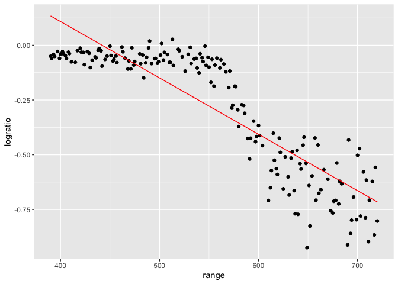
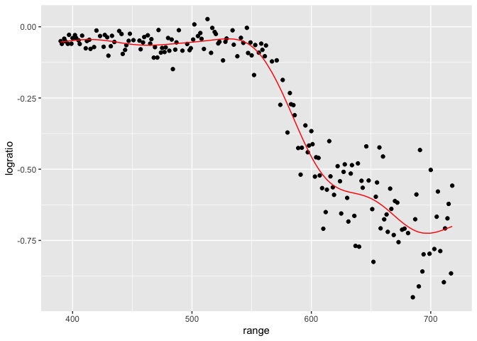
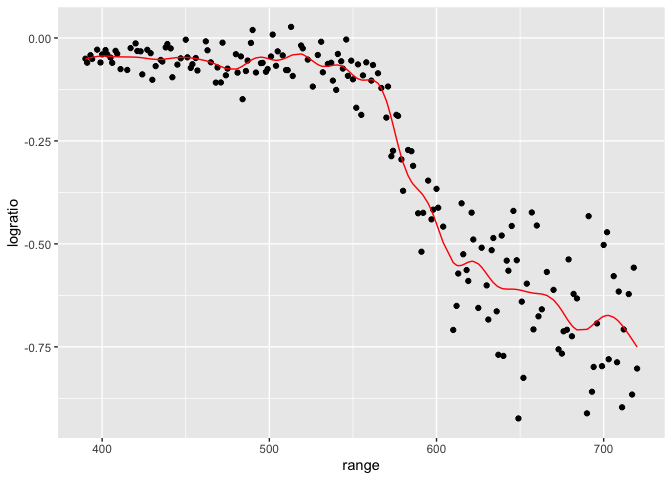
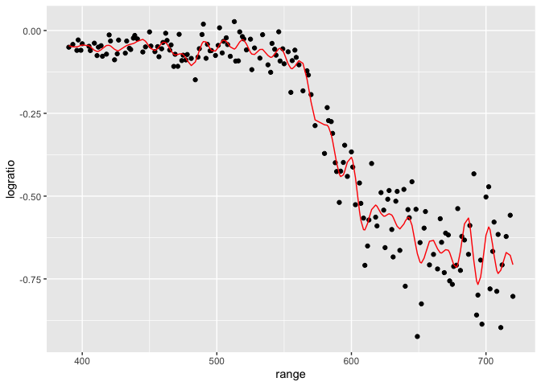
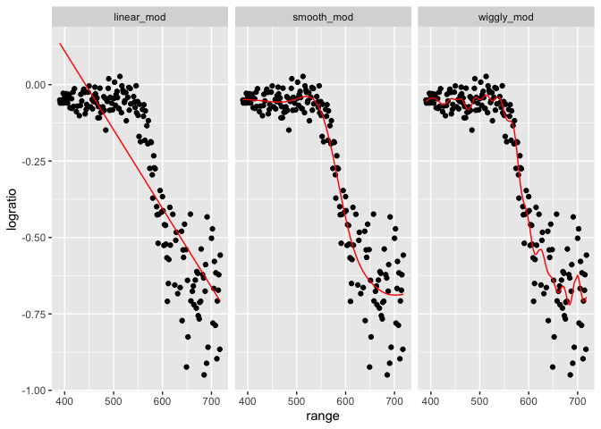
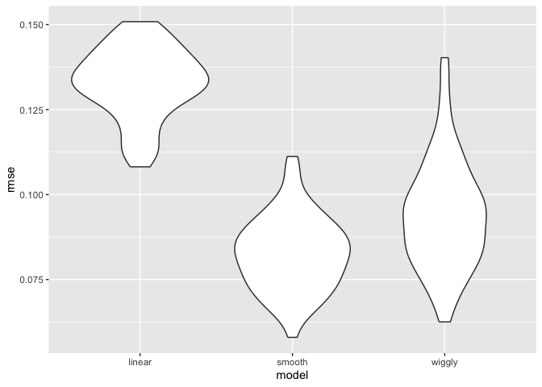
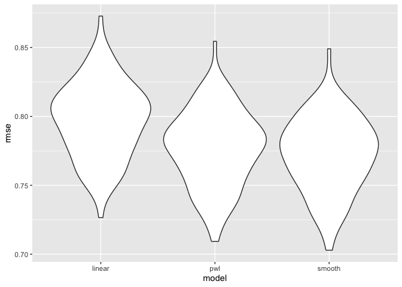

cross_validation
================
yz5248
2025-11-11

``` r
data("lidar")

lidar_df = 
  lidar |> 
  as_tibble() |>
  mutate(id = row_number())

lidar_df |> 
  ggplot(aes(x = range, y = logratio)) + 
  geom_point()
```

<!-- -->

# create dataframe

``` r
train_df = 
  sample_frac(lidar_df, size = .8) |>
  arrange(id)

test_df = anti_join(lidar_df, train_df, by = "id")
```

``` r
linear_mod = lm(logratio ~ range, data = train_df)
```

``` r
train_df |>
  add_predictions(linear_mod) |>
  ggplot(aes(x = range, y = logratio)) +
  geom_point() +
  geom_line(aes(y = pred), color = "red")
```

<!-- -->

``` r
smooth_mod = mgcv::gam(logratio ~ s(range), data = train_df)
```

``` r
train_df |>
  add_predictions(smooth_mod) |>
  ggplot(aes(x = range, y = logratio)) +
  geom_point() +
  geom_line(aes(y = pred), color = "red")
```

<!-- -->

``` r
wiggly_mod = mgcv::gam(logratio ~ s(range, k = 30), sp = 10e-6, data = train_df)
```

``` r
train_df |>
  add_predictions(wiggly_mod) |>
  ggplot(aes(x = range, y = logratio)) +
  geom_point() +
  geom_line(aes(y = pred), color = "red")
```

<!-- -->

``` r
wiggly_mod2 = mgcv::gam(logratio ~ s(range, k = 50), sp = 10e-8, data = train_df)
```

``` r
train_df |>
  add_predictions(wiggly_mod2) |>
  ggplot(aes(x = range, y = logratio)) +
  geom_point() +
  geom_line(aes(y = pred), color = "red")
```

<!-- -->

``` r
train_df |> 
  gather_predictions(linear_mod, smooth_mod, wiggly_mod) |> 
  mutate(model = fct_inorder(model)) |> 
  ggplot(aes(x = range, y = logratio)) + 
  geom_point() + 
  geom_line(aes(y = pred), color = "red") + 
  facet_wrap(~model)
```

<!-- -->

``` r
rmse(linear_mod, test_df)
```

    ## [1] 0.1251753

``` r
rmse(smooth_mod, test_df)
```

    ## [1] 0.06570813

``` r
rmse(wiggly_mod, test_df)
```

    ## [1] 0.06436572

now cross validation

``` r
cv_df = 
  crossv_mc(lidar_df, 100) |>
  mutate(
    train = map(train, as_tibble),
    test = map(test, as_tibble)
  )
```

did this work? Yes!

``` r
cv_df |> pull(train) |> nth(3)
```

    ## # A tibble: 176 × 3
    ##    range logratio    id
    ##    <dbl>    <dbl> <int>
    ##  1   390  -0.0504     1
    ##  2   391  -0.0601     2
    ##  3   394  -0.0510     4
    ##  4   396  -0.0599     5
    ##  5   397  -0.0284     6
    ##  6   399  -0.0596     7
    ##  7   400  -0.0399     8
    ##  8   402  -0.0294     9
    ##  9   405  -0.0476    11
    ## 10   406  -0.0604    12
    ## # ℹ 166 more rows

let’s fit the model over and over

``` r
lidar_lm = function(df){
  lm(logratio ~ range, data = df)
}
```

``` r
cv_df |>
  mutate(
    linear_fits = map(train, \(df) lm(logratio ~ range, data = df)),
    smooth_fits  = map(train, \(df) mgcv::gam(logratio ~ s(range), data = df)),
    wiggly_fits  = map(train, \(df) mgcv::gam(logratio ~ s(range, k = 50), sp = 10e-8, data = df))
  ) |>
  mutate(
    rmse_linear = map2(linear_fits, test, rmse),
    rmse_linear = map2(smooth_fits, test, rmse),
    rmse_linear = map2(wiggly_fits, test, rmse)
  )
```

    ## # A tibble: 100 × 7
    ##    train    test     .id   linear_fits smooth_fits wiggly_fits rmse_linear
    ##    <list>   <list>   <chr> <list>      <list>      <list>      <list>     
    ##  1 <tibble> <tibble> 001   <lm>        <gam>       <gam>       <dbl [1]>  
    ##  2 <tibble> <tibble> 002   <lm>        <gam>       <gam>       <dbl [1]>  
    ##  3 <tibble> <tibble> 003   <lm>        <gam>       <gam>       <dbl [1]>  
    ##  4 <tibble> <tibble> 004   <lm>        <gam>       <gam>       <dbl [1]>  
    ##  5 <tibble> <tibble> 005   <lm>        <gam>       <gam>       <dbl [1]>  
    ##  6 <tibble> <tibble> 006   <lm>        <gam>       <gam>       <dbl [1]>  
    ##  7 <tibble> <tibble> 007   <lm>        <gam>       <gam>       <dbl [1]>  
    ##  8 <tibble> <tibble> 008   <lm>        <gam>       <gam>       <dbl [1]>  
    ##  9 <tibble> <tibble> 009   <lm>        <gam>       <gam>       <dbl [1]>  
    ## 10 <tibble> <tibble> 010   <lm>        <gam>       <gam>       <dbl [1]>  
    ## # ℹ 90 more rows

``` r
cv_df = 
  cv_df |> 
  mutate(
    linear_mod  = map(train, \(df) lm(logratio ~ range, data = df)),
    smooth_mod  = map(train, \(df) gam(logratio ~ s(range), data = df)),
    wiggly_mod  = map(train, \(df) gam(logratio ~ s(range, k = 50), sp = 10e-8, data = df))) |> 
  mutate(
    rmse_linear = map2_dbl(linear_mod, test, \(mod, df) rmse(model = mod, data = df)),
    rmse_smooth = map2_dbl(smooth_mod, test, \(mod, df) rmse(model = mod, data = df)),
    rmse_wiggly = map2_dbl(wiggly_mod, test, \(mod, df) rmse(model = mod, data = df))
    )
```

try to look at this better

``` r
cv_df |> 
  select(starts_with("rmse")) |> 
  pivot_longer(
    everything(),
    names_to = "model", 
    values_to = "rmse",
    names_prefix = "rmse_") |> 
  mutate(model = fct_inorder(model)) |> 
  ggplot(aes(x = model, y = rmse)) + geom_violin()
```

<!-- -->

``` r
growth_df = read_csv("nepalese_children.csv")
```

    ## Rows: 2705 Columns: 5
    ## ── Column specification ────────────────────────────────────────────────────────
    ## Delimiter: ","
    ## dbl (5): age, sex, weight, height, armc
    ## 
    ## ℹ Use `spec()` to retrieve the full column specification for this data.
    ## ℹ Specify the column types or set `show_col_types = FALSE` to quiet this message.

``` r
growth_df |> 
  ggplot(aes(x = weight, y = armc)) + 
  geom_point(alpha = .5)
```

<!-- -->

``` r
growth_df = 
  growth_df |>
  mutate(weight_cp7 = (weight > 7) * (weight - 7))
```

``` r
linear_mod = lm(armc ~ weight, data = growth_df)
pwl_mod    = lm(armc ~ weight + weight_cp7, data = growth_df)
smooth_mod = mgcv::gam(armc ~ s(weight), data = growth_df)
```

``` r
growth_df |>
  add_predictions(pwl_mod) |>
  ggplot(aes(x = weight, y = armc)) + 
  geom_point(alpha = .5) +
  geom_line(aes(y = pred), color = "red")
```

<!-- -->

``` r
growth_df |> 
  gather_predictions(linear_mod, pwl_mod, smooth_mod) |> 
  mutate(model = fct_inorder(model)) |> 
  ggplot(aes(x = weight, y = armc)) + 
  geom_point(alpha = .5) +
  geom_line(aes(y = pred), color = "red") + 
  facet_grid(~model)
```

<!-- -->
Now cross validation

``` r
cv_df =
  crossv_mc(growth_df, 100) |> 
  mutate(
    train = map(train, as_tibble),
    test = map(test, as_tibble))
```

``` r
cv_df = 
  cv_df |> 
  mutate(
    linear_mod  = map(train, \(df) lm(armc ~ weight, data = df)),
    pwl_mod     = map(train, \(df) lm(armc ~ weight + weight_cp7, data = df)),
    smooth_mod  = map(train, \(df) mgcv::gam(armc ~ s(weight), data = df))
    )|> 
  mutate(
    rmse_linear = map2_dbl(linear_mod, test, rmse),
    rmse_pwl = map2_dbl(pwl_mod, test, rmse),
    rmse_smooth = map2_dbl(smooth_mod, test, rmse)
  )
```

``` r
cv_df |> 
  select(starts_with("rmse")) |> 
  pivot_longer(
    everything(),
    names_to = "model", 
    values_to = "rmse",
    names_prefix = "rmse_") |> 
  ggplot(aes(x = model, y = rmse)) + 
  geom_violin()
```

<!-- -->
